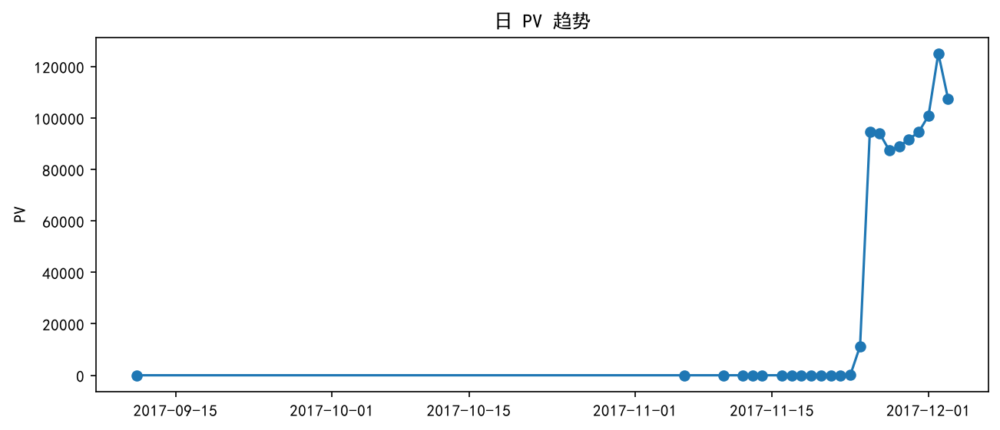
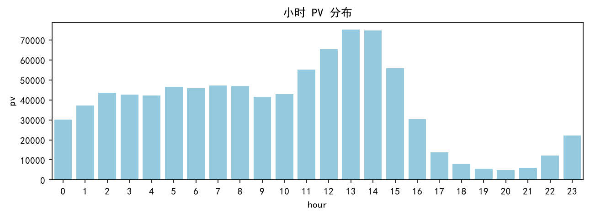
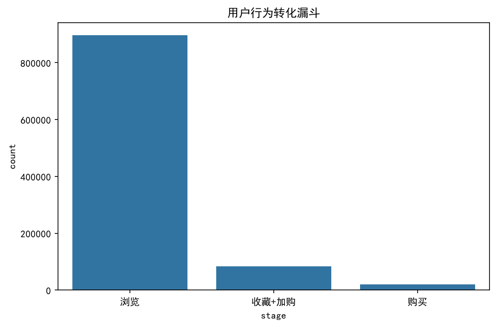
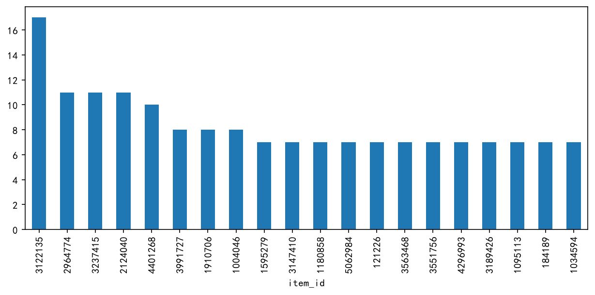

# 淘宝用户行为分析 报告

项目概览
- 数据来源：天池公开用户行为数据（data/UserBehavior.csv）。
- 分析目标：流量与转化基础分析、用户留存与复购、RFM 分层、商品与品类分析，并产出可视化图表供看板使用。

关键结论（摘要）
- **流量规模**：抽样 1,000,000 条记录中，PV（浏览）= 896,106，UV（独立用户）= 9,739。
- **转化漏斗**：收藏+加购→购买 转化约 **24.37%**；浏览→购买 转化约 **2.27%**；整体从浏览到收藏/加购转化约 **9.32%**。
- **跳失（近似）**：当天仅有一次行为的用户占比（近似跳失率）在 Notebook 中计算并保存为结果，建议结合会话/页面级数据进一步精确。
- **复购与留存**：已生成 Cohort 表和复购率统计（SQL 示例在 sql/ 中），复购率与复购周期分布可用于识别高价值复购群体。
- **RFM 分层**：用购买次数近似 M 值，基于 Recency/Frequency 用 KMeans 聚类分为 4 类，得到每类的中位数特征以供运营策略划分。

可视化（已生成）
- 日PV趋势：

	

- 小时 PV 分布：

	

- 用户行为转化漏斗：

	

- Top20 购买商品：

	

核心业务建议（对应分析结论）
- **提升浏览→收藏/加购 转化**：在浏览→收藏/加购转化率较低的时段（见小时分布），增加引导弹窗和及时优惠券推送；A/B 测试商品详情页 CTA 与图片顺序。建议在周末高峰与晚间 20-22 点加强促推。
- **提升收藏/加购→购买**：针对已收藏或加购但未购买的用户，做 48 小时内的精准短信/APP 推送（带小额优惠或免邮券），并在推送中直接跳转到购物车结算页，降低结算路径摩擦。
- **复购激励**：对复购用户提供忠诚度积分和定期专属优惠；根据复购周期分布，设置在预计回购前 3-7 天发送提醒与个性化推荐。
- **用户分层运营**：基于 RFM/聚类结果，分别设计：新客激励（首单券）、活跃用户激励（会员权益）、沉默用户召回（优惠券+个性化推荐）、流失用户长期唤醒（邮件/短信结合大额优惠）。

技术与交付内容
- 代码：Notebook（notebook/analysis.ipynb）已包含可复现的 pandas 分析单元与图表保存逻辑。
- SQL：`sql/01_funnel.sql`、`sql/02_retention.sql`、`sql/03_rfm.sql`、`sql/04_repurchase.sql` 提供在 MySQL 上执行的查询样例（含 cohort 与复购窗口函数写法），便于面试时展示复杂 SQL 能力。
- 脚本：已提供 `scripts/analysis.py` 可直接生成关键图表并保存到 `charts/`。
- 环境：见 `requirements.txt`（pandas/matplotlib/seaborn/sqlalchemy/scikit-learn 等）。

# 淘宝用户行为分析 — 报告

## 一、项目背景与目标
- 数据来源：天池公开的用户行为数据（文件：data/UserBehavior.csv）。
- 样本量：本次演示以抽样 1,000,000 条记录为基础，既保留代表性又保证计算效率。
- 目标：完成流量与转化（PV/UV、小时/日活、漏斗）、用户留存与复购分析、RFM 分层与聚类验证、商品与品类分析，并输出可供 Power BI 构建的可视化素材与 SQL 查询脚本。

## 二、核心发现（关键数字）
- PV（浏览）：896,106；UV（独立用户）：9,739。
- 转化漏斗：浏览→收藏/加购 转化约 9.32%；收藏/加购→购买 转化约 24.37%；浏览→购买 转化约 2.27%。
- 跳失率（近似）：通过统计当天仅发生一次行为的用户占比给出初步估计（具体数值见 Notebook 输出）。
- 复购：使用购买行为构建的复购率与复购周期，用于识别高价值复购用户群体（详见 sql/03_rfm.sql、sql/04_repurchase.sql）。

## 三、详细分析与业务建议

1) 流量与活跃
- 发现：日 PV 与小时分布显示峰值集中在若干时间窗（见 charts/daily_pv.png 与 charts/hourly_pv.png）。
- 建议：在峰值时段（例如晚间高峰）投放更多曝光与优惠消息；在低谷时段尝试精准召回或邮箱推送以提高次日活跃。

2) 漏斗与跳失
- 发现：从浏览到收藏/加购的初始转化仍较低；从收藏/加购到购买的转化相对较高，说明对目标用户的后续激励有效。
- 建议：优化商品详情页与加入购物车流程，减少结算路径摩擦；对已收藏/已加购但未购买人群实施 48 小时内的提醒与限时券策略。

3) 留存与复购
- 发现：Cohort 分析与复购周期给出用户在首单后的留存趋势与常见复购间隔（详见 notebook/analysis.ipynb 输出与 sql/02_retention.sql、sql/04_repurchase.sql）。
- 建议：对次日/7日/30日低留存的 cohort 施行差异化召回（短期内以优惠券+推送为主，长期以邮件+会员权益为主）。

4) RFM 分层与用户分群
- 发现：基于 Recency/Frequency 的聚类可划分出高价值、流失倾向与新客等用户簇。
- 建议：对高价值用户提供专属权益（积分、定向折扣）；对沉默用户用个性化内容尝试召回；对新客投入首单优惠与引导行为转化。

5) 商品与品类
- 发现：Top 商品列表（charts/top_items.png）可用于品类与折扣策略制定；关联购买分析建议用购物篮数据或订单级数据进行 Market Basket 分析（Apriori）。
- 建议：在库存与促销策略中优先考虑高频复购与高客单价商品。

## 四、可视化素材（已生成并存放）
- 日 PV 趋势：charts/daily_pv.png
- 小时 PV 分布：charts/hourly_pv.png
- 用户行为转化漏斗：charts/funnel.png
- Top20 购买商品：charts/top_items.png

（截图已保存于 `charts/`，用于嵌入 Power BI 或直接放入报告。）

## 五、Power BI 看板构建说明（面向快速复现）

目标看板页面建议：
- 首页 KPI 概览：PV、UV、日活、转化率（浏览→购买）、复购率
- 流量趋势页：日/周/月 PV 曲线、小时分布热力图
- 漏斗与落差页：漏斗可视化 + 各环节转化率与跳失趋势
- 留存与复购页：Cohort 热力图（首日/7日/30日留存）、复购周期分布直方图
- 用户分层页：RFM 雷达/散点图、各簇指标对比（人均消费、复购率）

数据准备：
1. 推荐方式：把 CSV 导入 MySQL（或直接连接 CSV），使用 `sql/` 中的脚本生成聚合表（如 daily_stats、cohort_table、rfm_summary），Power BI 直接连接 MySQL 查询视图，性能更好。
2. 若使用 CSV：在 Power BI 中用“获取数据 → 文本/CSV”加载 `data/UserBehavior.csv`，并在 Power Query 中做相同的数据清洗（timestamp→datetime、行为类型映射）。

关键 DAX / 可视化建议：
- 计算 PV/UV 可用度量：PV = COUNTROWS(FILTER(table, table[behavior]='pv'))；UV = DISTINCTCOUNT(table[user_id])
- 留存热力图：将 cohort_date 作为行，days_from_first 作为列，显示 DISTINCTCOUNT(user_id) / cohort_size
- 漏斗：Power BI 的 Funnel 可视化直接使用分阶段计数

交互设计：
- 时间切片器（日期范围）、渠道/品类筛选器、RFM 聚类切片器
- 鼠标悬停展示增量数与环比

## 六、交付文件清单
- Notebook：notebook/analysis.ipynb
- 可执行脚本：scripts/analysis.py
- SQL：sql/*.sql
- 图表静态图片：charts/*.png
- 报告（本 README）

## 数据说明

原始数据文件 `data/UserBehavior.csv` 约 3.67 GB，未上传至 GitHub。
数据来源为阿里天池公开用户行为数据。运行分析代码前，请将数据文件放置到 `data/UserBehavior.csv`。